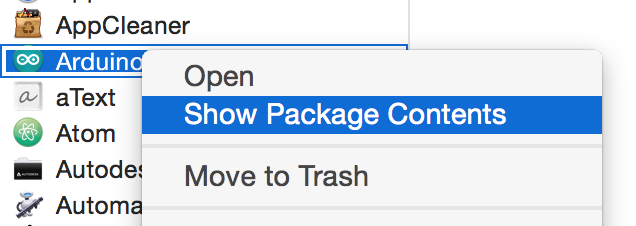
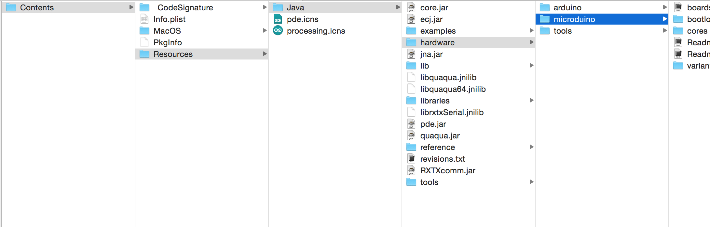
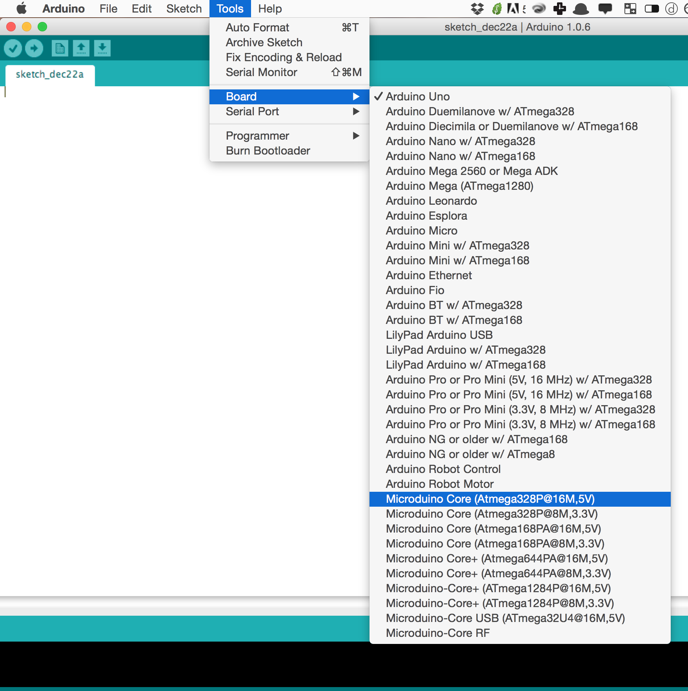
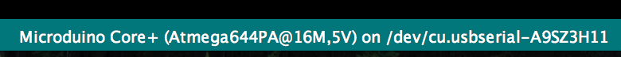

# The DIY Guide
> Already have the Arduino IDE or the latter guide not working?

## Get Started
1. [Download the Project as Zip](https://github.com/KyleKing/Microduino-IDE/archive/master.zip)
3. Find your Arduino IDE and right click to show package contents
...If you haven't, download Arduino IDE 1.0.X (The newest builds aren't fully supported)
4. From the unzipped folder, open the "DIY Modification" folder and move the "microduino" folder into the arduino folder as shown:

...
...
...
...

5. From the applications folder, open Arduino and check for the Microduino boards:

## Drivers
> Microduino needs a special driver [available here](http://www.ftdichip.com/Drivers/VCP.htm) or use the one downloaded with the repository

1. From the unzipped folder, select the "drivers" folder and double click the .dmg to install
2. Once done, restart your computer
3. It should work from here! Get coding

## FAQ
If you have any questions feel free to [start an issue](https://github.com/KyleKing/Microduino-IDE/issues)

