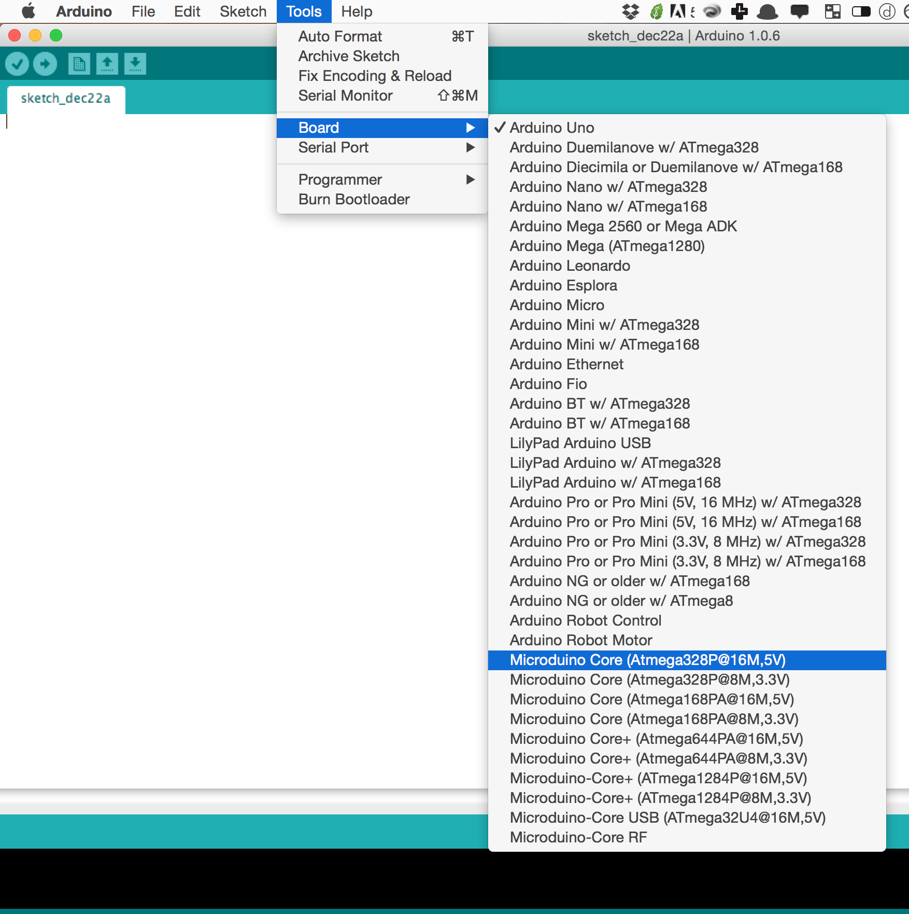
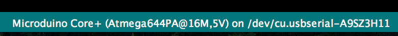

Microduino-IDE for Mac
==============
> Tutorial and files for Microduino microcontroller quick-start from a Mac

Already have Arduino installed? Add Microduino support manually with [this guide](DIY Modification) or follow this automated guide:

# Getting Started Guide
1. [Download the Project as Zip](https://github.com/KyleKing/Microduino-IDE/archive/master.zip)
2. Open the "Microduino IDE" folder and move the arduino.app file into your application folder
3. From the applications folder, open Arduino and check for the Microduino boards:
   
4. Then move on to the drivers section:

## Drivers
> Microduino needs a special driver

1. From the unzipped folder, select the "drivers" folder and double click the .dmg to install
2. Once done installing, restart your computer
3. It should work from here! Here is what my serial port connection looks like:
   

## FAQ
If you have any questions feel free to [start an issue](https://github.com/KyleKing/Microduino-IDE/issues)

## Guides and Sample Code
> Find official resources and code here:

- [Project Tutorials](https://www.microduino.cc/project)
- [Sample Code](https://github.com/Microduino/Microduino_Tutorials) - very useful
- [Wiki - support and tutorials](https://www.microduino.cc/wiki/index.php?title=Main_Page)

## References
- The Microduino Driver is [available here](http://www.ftdichip.com/Drivers/VCP.htm)
- [The Precursor to this Guide](https://www.microduino.cc/project/view?id=5482ba0248f8313548d82b8c)
